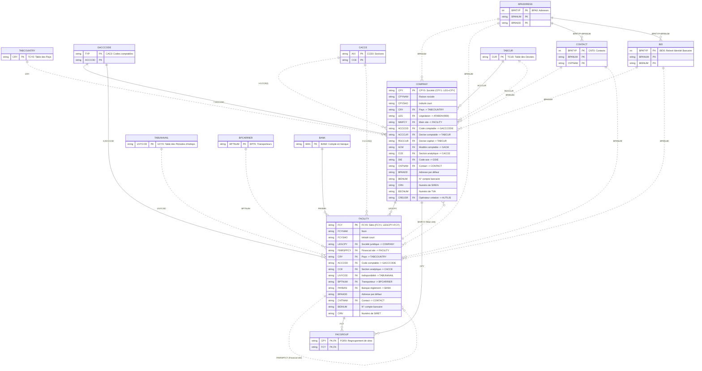

```mermaid
erDiagram
    %% Core Tables
    COMPANY {
        string CPY PK "CPY0: Société (CPY1: LEG+CPY)"
        string CPYNAM "Raison sociale"
        string CPYSHO "Intitulé court"
        string CRY FK "Pays -> TABCOUNTRY"
        string LEG FK "Législation -> ATABDIV(909)"
        string MAIFCY FK "Main site -> FACILITY"
        string ACCCOD FK "Code comptable -> GACCCODE"
        string ACCCUR FK "Devise comptable -> TABCUR"
        string RGCCUR FK "Devise capital -> TABCUR"
        string ACM FK "Modèle comptable -> GACM"
        string CCE FK "Section analytique -> CACCE"
        string DIE FK "Code axe -> GDIE"
        string CNTNAM FK "Contact -> CONTACT"
        string BPAADD "Adresse par défaut"
        string BIDNUM "N° compte bancaire"
        string CRN "Numéro de SIREN"
        string EECNUM "Numéro de TVA"
        string CREUSR FK "Opérateur création -> AUTILIS"
    }

    FACILITY {
        string FCY PK "FCY0: Sites (FCY1: LEGCPY+FCY)"
        string FCYNAM "Nom"
        string FCYSHO "Intitulé court"
        string LEGCPY FK "Société juridique -> COMPANY"
        string FINRSPFCY FK "Financial site -> FACILITY"
        string CRY FK "Pays -> TABCOUNTRY"
        string ACCCOD FK "Code comptable -> GACCCODE"
        string CCE FK "Section analytique -> CACCE"
        string UVYCOD FK "Indisponibilité -> TABUNAVAIL"
        string BPTNUM FK "Transporteur -> BPCARRIER"
        string PAYBAN FK "Banque règlement -> BANK"
        string BPAADD "Adresse par défaut"
        string CNTNAM FK "Contact -> CONTACT"
        string BIDNUM "N° compte bancaire"
        string CRN "Numéro de SIRET"
    }

    %% Reference & Supporting Tables from Diagram
    TABCOUNTRY {
        string CRY PK "TCY0: Table des Pays"
    }
    GACCCODE {
        string TYP PK "CAC0: Codes comptables"
        string ACCCOD PK
    }
    CACCE {
        string AXI PK "CCE0: Sections"
        string CCE PK
    }
    TABUNAVAIL {
        string UVYCOD PK "UVY0: Table des Périodes d'indispo."
    }
    BPCARRIER {
        string BPTNUM PK "BPT0: Transporteurs"
    }
    FACGROUP {
        string CPY PK,FK "FGR0: Regroupement de sites"
        string FCY PK,FK
    }
    BANK {
        string BAN PK "BAN0: Compte en banque"
    }
    BID {
        int BPATYP PK "BID0: Relevé Identité Bancaire"
        string BPANUM PK
        string BIDNUM PK
    }
    BPADDRESS {
        int BPATYP PK "BPA0: Adresses"
        string BPANUM PK
        string BPAADD PK
    }
    CONTACT {
        int BPATYP PK "CNT0: Contacts"
        string BPANUM PK
        string CNTNAM PK
    }
    TABCUR {
        string CUR PK "TCU0: Table des Devises"
    }

    %% Relationships (Solid = Mandatory/Blocking, Dashed = Optional/Lookup)
    TABCOUNTRY ||..o{ COMPANY : "CRY"
    GACCCODE ||--o{ COMPANY : "7;ACCCOD"
    CACCE ||..o{ COMPANY : "i+1;CCE(i)"
    TABCUR ||--o{ COMPANY : "ACCCUR"
    TABCUR ||..o{ COMPANY : "RGCCUR"
    CONTACT ||..o{ COMPANY : "BPANUM"
    BPADDRESS ||..o{ COMPANY : "BPANUM"
    BID ||..o{ COMPANY : "BPANUM"

    %% Company <-> Facility Links
    COMPANY ||--o{ FACILITY : "LEGCPY"
    FACILITY ||..o{ COMPANY : "MAIFCY (Main site)"
    FACILITY ||..o{ FACILITY : "FINRSPFCY (Financial site)"

    %% Facility Links
    GACCCODE ||--o{ FACILITY : "8;ACCCOD"
    CACCE ||..o{ FACILITY : "i+1;CCE(i)"
    TABUNAVAIL ||..o{ FACILITY : "UVYCOD"
    BPCARRIER ||..o{ FACILITY : "BPTNUM"
    COMPANY ||--o{ FACGROUP : "CPY"
    FACILITY ||--o{ FACGROUP : "FCY"
    BANK ||--o{ FACILITY : "PAYBAN"
    BID ||..o{ FACILITY : "BPANUM"
    BPADDRESS ||..o{ FACILITY : "BPANUM"
    CONTACT ||..o{ FACILITY : "BPANUM"

    %% Supporting Table Links
    BPADDRESS ||--o{ CONTACT : "BPATYP+BPANUM"
    BPADDRESS ||--o{ BID : "BPATYP+BPANUM"
```
