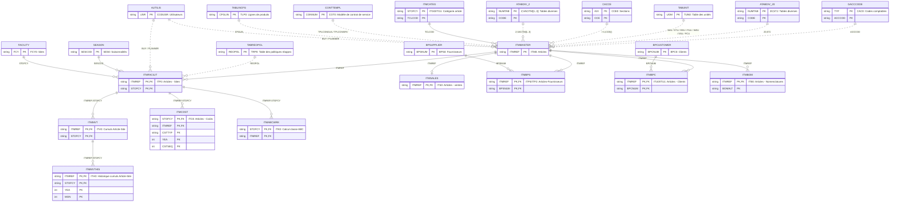

```mermaid
erDiagram
    %% Core Tables
    ITMMASTER {
        string ITMREF PK "ITM0: Articles"
    }
    ITMFACILIT {
        string ITMREF PK,FK "ITF0: Articles - Sites"
        string STOFCY PK,FK
    }

    %% Top Row Reference & Config Tables
    GACCCODE {
        string TYP PK "CAC0: Codes comptables"
        string ACCCOD PK
    }
    ATABDIV_20 {
        string NUMTAB PK "20;STJ: Tables diverses"
        string CODE PK
    }
    TABUNIT {
        string UOM PK "TUN0: Table des unités"
    }
    CACCE {
        string AXI PK "CCE0: Sections"
        string CCE PK
    }
    ATABDIV_2 {
        string NUMTAB PK "2;VACITM[1..3]: Tables diverses"
        string CODE PK
    }
    ITMCATEG {
        string STOFCY PK "ITG0/ITG1: Catégorie article"
        string TCLCOD PK
    }

    %% Side & Middle Tables
    CONTTEMPL {
        string CONNUM PK "COT0: Modèle de contrat de service"
    }
    TABLINCFG {
        string CFGLIN PK "TLP0: Lignes de produits"
    }
    ITMSALES {
        string ITMREF PK,FK "ITS0: Articles - ventes"
    }
    ITMBPS {
        string ITMREF PK,FK "ITP0/ITP2: Articles-Fournisseurs"
        string BPSNUM PK,FK
    }
    ITMBPC {
        string ITMREF PK,FK "ITU0/ITU1: Articles - Clients"
        string BPCNUM PK,FK
    }
    TABREOPOL {
        string REOPOL PK "TRP0: Table des politiques réappro"
    }
    ITMMVTHIS {
        string ITMREF PK,FK "ITH0: Historique cumuls Article-Site"
        string STOFCY PK,FK
        int YEA PK
        int MON PK
    }
    ITMMVT {
        string ITMREF PK,FK "ITV0: Cumuls Article-Site"
        string STOFCY PK,FK
    }
    AUTILIS {
        string USR PK "CODUSR: Utilisateurs"
    }
    ITMCOST {
        string STOFCY PK,FK "ITC0: Articles - Coûts"
        string ITMREF PK,FK
        string CSTTYP PK
        int YEA PK
        int CSTSEQ PK
    }

    %% Bottom Row Tables
    BPCUSTOMER {
        string BPCNUM PK "BPC0: Clients"
    }
    SEASON {
        string SESCOD PK "SES0: Saisonnalités"
    }
    FACILITY {
        string FCY PK "FCY0: Sites"
    }
    ITMABCWRK {
        string STOFCY PK,FK "ITK0: Calcul classe ABC"
        string ITMREF PK,FK
    }
    ITMBOM {
        string ITMREF PK,FK "ITB0: Articles - Nomenclatures"
        string BOMALT PK
    }
    BPSUPPLIER {
        string BPSNUM PK "BPS0: Fournisseurs"
    }

    %% Relationships (Solid = Mandatory/Identifying, Dashed = Optional/Lookup)
    GACCCODE ||..o{ ITMMASTER : "ACCCOD"
    ATABDIV_20 ||..o{ ITMMASTER : "20;STJ"
    TABUNIT ||..o{ ITMMASTER : "SAU / STU / EEU / PUU / WEU / SSU / PCU"
    CACCE ||..o{ ITMMASTER : "i+1;CCE(i)"
    ATABDIV_2 ||..o{ ITMMASTER : "2;VACITM[1..3]"
    ITMCATEG ||--o{ ITMMASTER : "TCLCOD"
    CONTTEMPL ||..o{ ITMMASTER : "TPLCONGUA / TPLCONSRV"
    TABLINCFG ||..o{ ITMMASTER : "CFGLIN"

    ITMMASTER ||--o| ITMSALES : "ITMREF"
    ITMMASTER ||--o{ ITMBPS : "ITMREF"
    ITMMASTER ||--o{ ITMBPC : "ITMREF"
    ITMMASTER ||--o{ ITMFACILIT : "ITMREF"
    ITMMASTER ||--o{ ITMBOM : "ITMREF"
    AUTILIS ||..o{ ITMMASTER : "BUY / PLANNER"

    BPCUSTOMER ||--o{ ITMBPC : "BPCNUM"
    BPSUPPLIER ||--o{ ITMBPS : "BPSNUM"

    TABREOPOL ||..o{ ITMFACILIT : "REOPOL"
    ITMFACILIT ||--o{ ITMMVT : "ITMREF;STOFCY"
    ITMFACILIT ||--o{ ITMCOST : "ITMREF;STOFCY"
    ITMFACILIT ||--o{ ITMABCWRK : "ITMREF;STOFCY"
    AUTILIS ||..o{ ITMFACILIT : "BUY / PLANNER"
    SEASON ||--o{ ITMFACILIT : "SESCOD"
    FACILITY ||--o{ ITMFACILIT : "STOFCY"

    ITMMVT ||--o{ ITMMVTHIS : "ITMREF;STOFCY"
```
